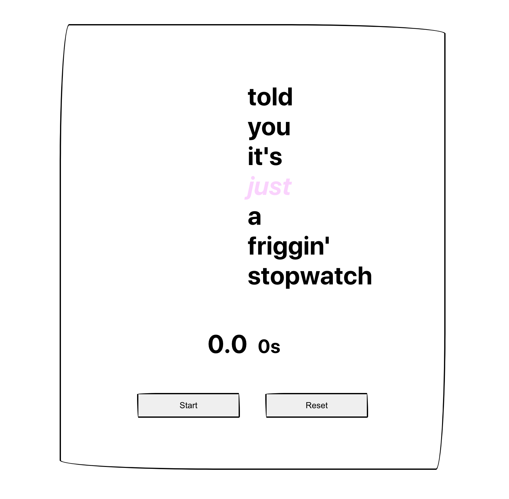

  
  <h1>Stopwatch;</h1>

- This project was bootstrapped with [Create React App](https://github.com/facebook/create-react-app).
- This project demonstrates how to use `setInterval`.

### ℹ️ What's implemented here?

- [x] React hooks
- [x] Single page app
